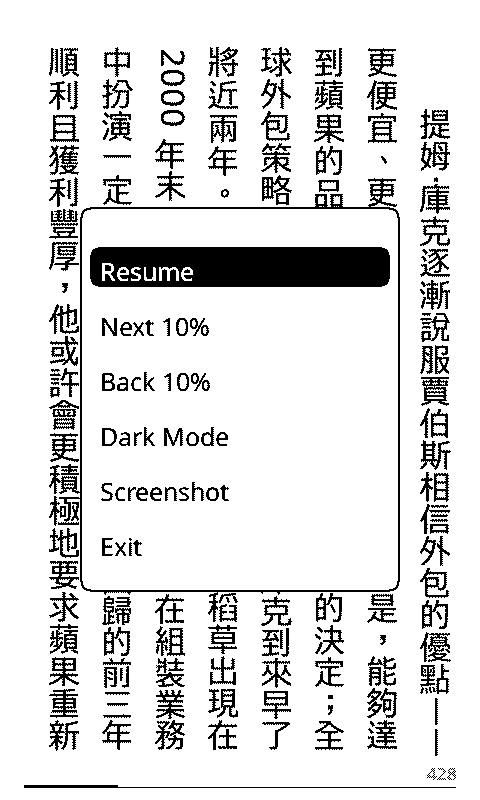
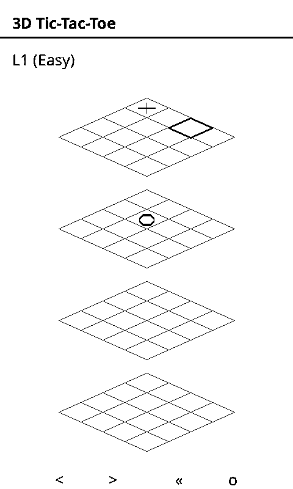
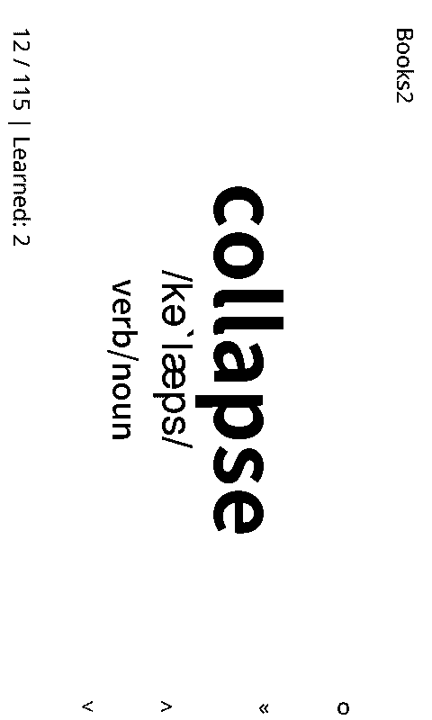

# Crosspoint Reader - Flow

**Crosspoint Reader - Flow** is a high-performance, plugin-driven firmware for the **Xteink X4** e-paper display reader. This project is a heavily modified fork of [CrossPoint Reader](https://github.com/crosspoint-reader/crosspoint-reader), specifically optimized for the X4 hardware with expanded capabilities in reading, gaming, and extensibility.

Built using **PlatformIO** and targeting the **ESP32-C3** microcontroller.

---

## 🚀 Key Innovations & Features

### 1. iPod-Inspired "Flow Theme"

Experience a premium, classic interface inspired by the iPod. The **Flow Theme** features smooth animations and a refined layout designed for the X4's e-ink screen.

### 2. Advanced Recent Page

Stay organized with a beautiful "Recent" view. Browse up to **36 of your most recently read books** with full cover art support for quick access.

### 3. Heavyweight XTC Support

Read massive volumes without compromise. Our optimized **XTC binary format** supports files over **200MB** and **2000+ pages**, ensuring stability on constrained hardware.

### 4. Contextual Menu & Dark Mode

Access tools without leaving the page. Both XTC and EPUB formats support a **floating inner-page menu** and a dedicated **Dark Mode** for comfortable night reading.

### 5. Dynamic Lua Plugin System

XTEINK X4 is a platform, not just a reader. The integrated **Lua scripting engine** allows for dynamic plugins that can extend core logic and create entirely new interfaces.

### 6. MiniGo (Lua Plugin)

A full-featured **9x9 Go game** powered by a professional **MCTS (Monte Carlo Tree Search)** engine. Challenge the AI directly on your reader.

### 7. Qubic (Lua Plugin)

Enjoy the classic **3D Tic-Tac-Toe** logic game, reimagined for the e-ink experience.

### 8. Flashcard (Lua Plugin)

Turn your reading materials into learning opportunities with an integrated **SRS (Spaced Repetition System)** Flashcard application.

### 9. System Intelligence

- **Reading Time Tracking**: The system automatically logs and calculates your reading duration for every book.
- **Smart Maintenance**: Automatic handling of reading records, metadata, and cache files to keep the system lean and responsive.

### 10. Core Performance

- **Memory Breakthrough**: 50% reduction in page table memory usage.
- **Instant Start**: Optimized refresh logic for near-instant book opening.
- **Snappy Response**: Reduced input cooldown (200ms) for a more responsive feel.

---

## 🖼️ Visual Showcase

### System Interface

|                  Flow Theme                   |          Recent Browser (36 Books)           |
| :-------------------------------------------: | :------------------------------------------: |
|  |  |

### Reading Experience

|            High-Capacity XTC             |               Floating Menu                |                  Dark Mode                  |
| :--------------------------------------: | :----------------------------------------: | :-----------------------------------------: |
|  |  |  |

### Gaming & Apps (Lua Plugins)

|            MiniGo (MCTS AI)            |        Qubic (3D Tic-Tac-Toe)        |               Flashcard (SRS)                |
| :------------------------------------: | :----------------------------------: | :------------------------------------------: |
|  |  |  |

---

## 🛠 Workflow: EPUB to XTC

To get the most out of the XTEINK X4, we recommend converting your EPUBs to XTC.
See the [EPUB to XTC Conversion Guide](../README.md#epub-轉檔-xtc-指南) in the root directory for the SOP.

---

## 💾 Installation & Development

### Web Flash

Visit [xteink.dve.al](https://xteink.dve.al/) for one-click setup and updates.

### Manual Build

```sh
git clone --recursive https://github.com/lee/xteink-x4-reader
pio run --target upload
```

---

## ⚖️ Disclaimer & Acknowledgments

This project is **not affiliated with Xteink** or the original CrossPoint authors. It is a community-driven enhancement.

Huge thanks to:

- The original **CrossPoint Reader** team.
- **atomic14** for the [diy-esp32-epub-reader](https://github.com/atomic14/diy-esp32-epub-reader).

---

_XTEINK X4: Unlock the true potential of your E-reader._
